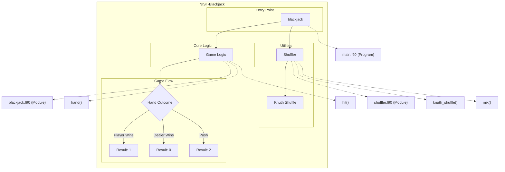

# Overview

The **NIST-Blackjack** repository provides a robust implementation of a simple text-based Blackjack game alongside utility programs for shuffling integers using the Knuth shuffle algorithm. Written in Fortran, this repository showcases efficient handling of game logic, card shuffling, and randomization techniques. The codebase emphasizes modularity and clarity, making it suitable for educational purposes, algorithm demonstrations, or further extensions to more sophisticated simulations.

The repository includes modules for key Blackjack operations, shuffling algorithms, and external utilities for random number initialization. It also offers test scripts for validating functionality and a configuration for continuous integration.

## Key Features

- **Text-based Blackjack Game**: Simulates a simplified version of Blackjack, including player and dealer logic with scoring and outcome determination.
- **Knuth Shuffle Implementation**: Provides a reliable utility for randomizing arrays using the Fisher-Yates shuffle algorithm.
- **Modular Design**: Includes separate modules for card shuffling (`shuffler.f90`) and game logic (`blackjack.f90`), ensuring clean separation of concerns.
- **Debug Mode**: Offers optional debug functionality for manually controlling the deck during gameplay.
- **Randomized Integer Utility**: Standalone program (`rand_order.f90`) for shuffling lists of integers, ideal for randomized ordering of sequences like team numbers.
- **Cross-platform Compatibility**: Builds using CMake, FPM, and Meson for flexibility across different development environments.
- **Test Suite**: Includes Python and CMake-based testing utilities to ensure correctness of critical components such as card handling.

# Layout and Architecture
```
# File Tree (with comments)

└── 9e06fac7-ad7b-4b27-8ac5-7af42df53bcd
    ├── NIST-Blackjack
        ├── .github
        │   └── workflows
        │       └── ci.yml        # CI pipeline configuration
        ├── CMakeLists.txt        # Build system configuration (CMake)
        ├── CMakePresets.json     # CMake presets
        ├── LICENSE               # License for the project
        ├── README.md             # Project overview and instructions
        ├── fpm.toml              # Fortran package manager configuration
        ├── meson.build           # Build system configuration (Meson)
        ├── app                   # Application entry points
        │   ├── main.f90          # Blackjack simulation main program
        │   └── rand_order.f90    # Integer shuffling program
        ├── src                   # Core program logic and modules
        │   ├── blackjack.c       # Blackjack logic (C implementation)
        │   ├── blackjack.f90     # Blackjack logic (Fortran implementation)
        │   └── shuffler.f90      # Module for Knuth Shuffle
        └── tests                 # Testing utilities
            ├── test_hit.cmake    # CMake-based test configuration
            ├── test_hit.py       # Python-based test script
            └── y.asc             # Auxiliary test data
```




## Usage Examples

### Build

Build the repositories using CMake:

```sh
mkdir build
cmake -B build
cmake --build build
```

### Test

Run tests using Python:

The script `test_hit.py` invokes the executable and ensures its successful execution based on predefined inputs.

```sh
python3 tests/test_hit.py build/f_blackjack
```

Run tests using CMake:

CMake configuration `test_hit.cmake` also allows testing programs using an auxiliary input file:

```sh
ctest
```

### Run

Run the Fortran Blackjack game:

The main program simulates a round of blackjack. Use `-d` flag to enable debug mode for input cards:

```sh
./build/f_blackjack
./build/f_blackjack -d
```

Run the Integer Shuffle program:

Provide the maximum integer as input via the command line to shuffle integers:

```sh
./build/rand_order 100
```


### Key Feature Implementation Deep Dive

Below is a detailed implementation analysis of the key features of the NIST-Blackjack repository. These features are crucial for understanding the architecture and functionality of the code.

---

#### 1. **Knuth Shuffle (`shuffler.f90`)**
The Knuth Shuffle, also known as the Fisher-Yates Shuffle, is implemented in the `shuffler` module. This algorithm ensures a uniform random permutation of elements within an array.

- **Implementation**:  
The `knuth_shuffle` subroutine accepts an integer array (`A`) and performs in-place shuffling. It iterates backwards through the array, selecting a random index (`j`) between the current position and the start of the array. The selected element is swapped with the current element. To generate the random index, the intrinsic `random_number` function is used.
  
- **Usage Context**:  
This subroutine is foundational for shuffling decks of cards in the Blackjack implementation. The `mix` subroutine in the `game` module invokes `knuth_shuffle` to randomize the card order in the deck.

- **Expansion Opportunities**:  
The shuffle algorithm could be generalized or adapted for different data types or structures beyond integer arrays.

---

#### 2. **Deck Initialization and Shuffle (`mix` in `blackjack.f90`)**
The `mix` subroutine initializes a deck representing standard playing cards and shuffles them using the Knuth Shuffle.

- **Implementation**:  
The `cards` array is populated with integers to represent card values (e.g., `2-10`, `10` for face cards, and `11` for aces). After initialization, the `knuth_shuffle` subroutine is invoked to shuffle the deck.

- **Usage Context**:  
This subroutine is called during the start of the Blackjack game (via the `main.f90` program) to prepare a randomized deck. The shuffled deck is then passed to the `hand` function.

- **Expansion Opportunities**:  
Additional functionality could support custom deck definitions or implement multiple decks (for games like casino-style Blackjack).

---

#### 3. **Game Logic (`hand` in `blackjack.f90`)**
The `hand` function simulates a complete round of Blackjack between a player and a dealer.

- **Implementation**:  
The `hand` function orchestrates the dealing of cards, player actions (e.g., `hit`, `stand`), dealer logic, and game outcome determination. It uses a loop for the player's actions, taking inputs (`yes/no`) via standard IO. The dealer follows house rules: hitting until reaching or exceeding a total of `17`. The scores are adjusted dynamically using the `hit` subroutine for flexible ace handling.

- **Determining the Outcome**:
  - `0`: Dealer wins.
  - `1`: Player wins.
  - `2`: Push (tie).

- **Usage Context**:  
The `hand` function is the core logic determining the gameplay sequence. It is invoked from `main.f90` after the deck is shuffled.

- **Expansion Opportunities**:  
The function could be extended to support multi-player scenarios or additional house rules. It could also benefit from improvements in user interface design or integration with a graphical front-end.

---

#### 4. **Score and Ace Management (`hit` in `blackjack.f90`)**
The `hit` subroutine processes the drawing of a card and updates game scores.

- **Implementation**:  
This subroutine modifies the player's or dealer's total score based on the value of the drawn card. If the card is an ace (`11`), it increments the count of aces. Additionally, the subroutine adjusts the scores dynamically, treating aces as `1` when necessary to prevent exceeding `21`.

- **Debug Mode**:  
In debug mode, users can manually input cards instead of drawing randomly, aiding in testing and verifying functionality.

- **Usage Context**:  
The `hit` subroutine is repeatedly called during the execution of `hand`, both for the player and the dealer's actions.

- **Expansion Opportunities**:  
Additional flags or modes could be added to support testing features, advanced rules, or logging functionalities.

---

#### 5. **Gameplay Execution (`main.f90`)**
The `main.f90` program is the entry point for the Blackjack simulation. It sets up the game environment, initializes the deck, and processes a single round.

- **Implementation**:  
This program starts by initializing the random number generator (`random_init`). It checks for a debug flag (`-d`) in the command-line arguments and toggles the `debug` attribute accordingly. The deck is shuffled using `mix`, and the Blackjack round is executed through the `hand` function.

- **Usage Context**:  
The program ties together the functionalities from the `game` and `shuffler` modules, acting as the orchestrator for the simulation.

- **Expansion Opportunities**:  
The program could evolve into a more interactive application, supporting multiple hands, score tracking, or visual presentation of cards.

---

### How These Features Fit Together

1. **Starting Point**: The `main.f90` program initializes the environment and starts the game sequence.
2. **Shuffling**: The deck is prepared and shuffled via `mix`, which relies on the `knuth_shuffle` subroutine.
3. **Gameplay**:
   - The `hand` function executes the game, interacting with the player and simulating dealer actions.
   - The `hit` subroutine manages score updates and ace adjustments during card draws.
4. **Randomness**: The integrity of randomness in the shuffle ensures fair gameplay.

Together, these features establish a cohesive and extensible architecture for simulating Blackjack.

---

### Final Summary

The NIST-Blackjack repository implements key features essential for a text-based blackjack simulator. Its modular design facilitates smooth interactions between components, making it suitable for enhancements. Developers can extend functionality by improving existing algorithms or introducing new gameplay features.


# Implemented User Stories

## Blackjack Game Functionality
- [ ] As a player, I want to play a Blackjack game using a shuffled standard deck, so that I can experience a simulation of the card game, which requires initializing the deck and shuffling it.
- [ ] As a player, I want to decide whether to hit or stand based on my card total during the game, so that I can influence the game outcome, which requires a mechanism to process each player's decision.
- [ ] As a dealer, I want the game to automatically simulate my moves based on predefined rules, so that the game progresses according to standard Blackjack logic, which requires the ability to evaluate card totals and make decisions.
- [ ] As a player, I want to see the outcome of each hand (win/loss/tie), so that I can track the game's results, which requires comparing scores between the dealer and player.

## Deck Shuffling
- [ ] As a user, I want the deck of cards to be shuffled randomly before each game, so that the order of the cards is unpredictable, which requires the Knuth shuffle algorithm to perform the shuffling.
- [ ] As a developer, I want to reuse the shuffling logic across different modules, so that it can be applied to both Blackjack and other randomization tasks, which requires creating a modular shuffle utility.

## Integer Randomization
- [ ] As a user, I want to input a range of integers and get a shuffled order of those integers, so that I can randomize sequences for other tasks, which requires implementing the Knuth shuffle on integer arrays.
- [ ] As a developer, I want to initialize and use a random number generator, so that shuffling produces varied results, which requires random initialization routines with customizable settings.

## Debugging and Testing
- [ ] As a developer, I want a debugging mode for the Blackjack game, so that I can input cards manually to test specific scenarios, which requires a flag to enable debug features.
- [ ] As a developer, I want automated tests to verify the behavior of game logic and shuffling components, so that I can ensure correctness and reliability, which requires test configurations and scripts.
- [ ] As a tester, I want example data to verify the outputs of shuffling and Blackjack conditions, so that I can validate edge cases, which requires auxiliary test files.

## Modular Component Reusability
- [ ] As a developer, I want the shuffling logic encapsulated in a reusable module, so that it can be leveraged by any program requiring random permutations, which requires a well-documented shuffler module.
- [ ] As a programmer, I want the Blackjack game logic encapsulated in a module, so that it can be extended or modified for different applications, which requires a structured design for handling player actions, dealer logic, and scoring.

## Command-Line Interface
- [ ] As a user, I want to pass command-line arguments to enable debugging or adjust game settings, so that I can customize the simulation, which requires a mechanism to capture and process these inputs.
- [ ] As a user, I want to run a program that outputs the results of integer shuffling, so that I can efficiently randomize sequences without manual input, which requires a CLI interface for the randint program.


# Dependencies


## Intrinsic

Standard Fortran intrinsic modules and functions.
- **iso_c_binding**
  - `c_int`
- **iso_fortran_env**
  - `ALL`
## Internal

Modules and functions defined within this project that are accessed in a different module or program.
- **shuffler**
  - `knuth_shuffle`
- **game**
  - `debug`
  - `hand`
  - `mix`
## External Functions

External (non-Fortran, bound with the C ABI) functions called by this project.
- `hit`
- `knuth_shuffle`
- `mix`
