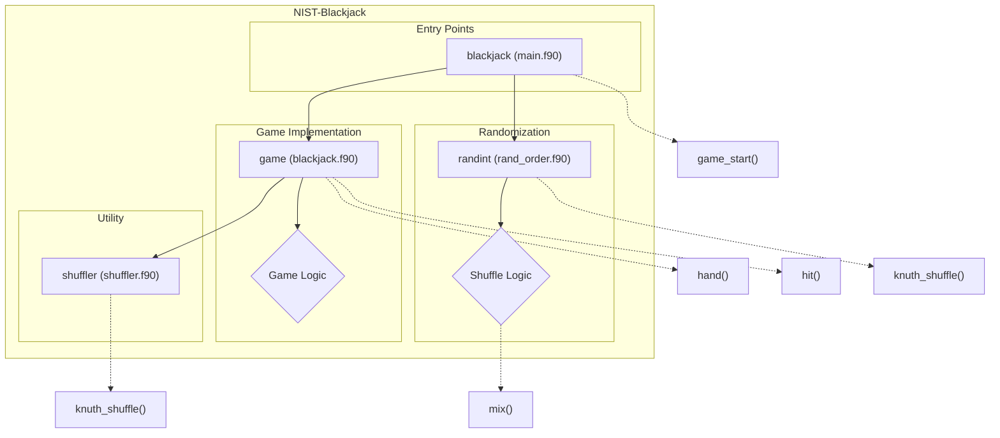

# Overview This is a test

The **NIST-Blackjack** repository provides a simplified implementation of the Blackjack game, demonstrating core game mechanics such as shuffling, card dealing, player decision-making, and dealer logic. The project is written in modern Fortran, showcasing efficient use of its intrinsic capabilities and algorithms like the Knuth (Fisher-Yates) shuffle. In addition to the Blackjack game, the repository includes a utility for randomized integer shuffling, making this codebase a versatile starting point for exploring randomization and game simulations.

## Key Features

- **Blackjack Simulation**: A complete game implementation that handles player and dealer interactions, deck shuffling, and game rules enforcement.
- **Knuth Shuffle Algorithm**: Utilizes an efficient implementation of the Knuth (Fisher-Yates) shuffle for randomizing arrays.
- **Randomized Integer Shuffling**: A standalone utility for shuffling a list of integers, ideal for use cases beyond card games.
- **Debugging Support**: Run the Blackjack simulation in debug mode to trace and analyze game logic.
- **Modular Design**: Encapsulates functionality into well-defined modules for shuffling, game logic, and card operations, promoting clean and reusable code.
- **Multi-Build System Support**: Includes configuration files for multiple build systems like CMake and Meson.
- **Test Suite**: Provides testing infrastructure with CMake and Python scripts to ensure correctness and functionality.

# Layout and Architecture
```
└── fab9a6df-3671-453c-8f71-51998a2bdb83
    └── NIST-Blackjack
        ├── .github                    # GitHub-specific configurations
        │   └── workflows
        │       └── ci.yml             # CI pipeline configuration
        ├── CMakeLists.txt             # CMake build configuration
        ├── CMakePresets.json          # CMake preset settings
        ├── LICENSE                    # Project license
        ├── README.md                  # Project documentation and usage
        ├── app                        # Application programs
        │   ├── main.f90               # Blackjack game main program
        │   └── rand_order.f90         # Random integer ordering utility
        ├── fpm.toml                   # Package configuration for Fortran Package Manager
        ├── meson.build                # Meson build configuration
        ├── src                        # Core source files
        │   ├── blackjack.c            # C file for Blackjack logic (if applicable)
        │   ├── blackjack.f90          # Fortran module implementing Blackjack logic
        │   └── shuffler.f90           # Fortran module for array shuffling (Knuth algorithm)
        └── tests                      # Testing utilities and files
            ├── test_hit.cmake         # CMake script for hit tests
            ├── test_hit.py            # Python script for testing the hit logic
            └── y.asc                  # Possibly a test data or configuration file
```




## Usage Examples

### Build

Compile the game repository:
```bash
mkdir build
cd build
cmake ..
make
```

### Test

Run the full set of tests:
```bash
ctest
```

### Run

Run the Blackjack game:
```bash
./game
```

### Feature Usage

#### Initialize and Shuffle a Deck

The `mix` subroutine initializes a standard deck of cards and shuffles them using the Knuth Shuffle algorithm.
```fortran
integer :: cards(52)
call mix(cards)
print *, cards
```

#### Simulate a Blackjack Hand

The `hand` function simulates a game of Blackjack, handling the dealer and player logic, as well as calculating the result.
```fortran
integer :: cards(52), result
call mix(cards)
result = hand(cards)
print *, "Game Result: Player Wins=" , result == 1, "Push=", result == 2, "Dealer Wins=", result == 0
```

#### Shuffle an Array

Use the `knuth_shuffle` subroutine to shuffle any array of integers.
```fortran
use shuffler, only: knuth_shuffle
integer :: array(10) = [1,2,3,4,5,6,7,8,9,10]
call knuth_shuffle(array)
print *, "Shuffled Array: ", array
```

#### Draw a Card ("Hit")

The `hit` subroutine provides logic for drawing cards and updating totals, including special handling for aces.
```fortran
integer :: total, aces, i
integer :: cards(52)
call mix(cards)
call hit(total, aces, i, cards)
print *, "Total: ", total, "Aces: ", aces
```


# Key Feature Implementation Deep Dive

## 1. Knuth Shuffle Algorithm
### Overview
The Knuth shuffle algorithm (implemented in `src/shuffler.f90`) is crucial for ensuring randomized order within an integer array. This feature is primarily utilized for shuffling the deck of cards in the Blackjack game, producing a fair and unbiased shuffle each time.

### Implementation Details
- **Subroutine:** `knuth_shuffle`
  - Arguments:
    - `A`: A one-dimensional integer array (input/output).
  - Logic:
    - Iterates backward over the array (`do i = size(A), 2, -1`).
    - Randomly selects an index from `1` to `i` using the intrinsic `random_number` procedure.
    - Swaps the current element with the randomly chosen element.
  - Example Application:
    - Used by the `mix` subroutine in `src/blackjack.f90` to shuffle the deck of 52 cards.

## 2. Blackjack Game Logic
### Overview
The heart of the application revolves around the Blackjack gameplay implemented in the `game` module (`src/blackjack.f90`). It manages player and dealer actions, game rules, and win/loss conditions.

### Implementation Details
- **Functions and Subroutines:**
  - `hand(cards)`:
    - Accepts a shuffled deck of cards as input.
    - Simulates a single Blackjack hand, managing player decisions (hitting or standing) and resolving dealer outcomes.
    - Returns an integer result indicating the game's outcome: `1` (player win), `0` (dealer win), or `2` (push).
  - `mix(cards)`:
    - Constructs a standard 52-card deck and shuffles it using the `knuth_shuffle` subroutine.
  - `hit(total, aces, i, cards)`:
    - Adds a card to the player's or dealer's total.
    - Manages Aces (value adjustment when total exceeds 21).
- **Integration:**
  - The `hand` function provides the gameplay logic, while `hit` handles dynamic score adjustments during card draws.

## 3. Main Blackjack Application
### Overview
The application entry point (`app/main.f90`) connects the shuffling and gameplay logic to provide a seamless user experience.

### Implementation Details
- **Program:** `blackjack`
  - Initializes the random generator and calls `mix` to shuffle the deck.
  - Evaluates the gameplay through the `hand` function.
  - Allows activation of debug mode via the `-d` flag in command-line arguments.

## 4. Testing Framework for `hit`
### Overview
A Python-based testing script (`tests/test_hit.py`) ensures the robustness of the `hit` subroutine.

### Implementation Details
- **Logic:**
  - Starts the Blackjack program using `subprocess.Popen`.
  - Simulates user input (choosing "hit").
  - Monitors the program for completion, verifying that the `hit` logic executes correctly without errors.
- **Utility:**
  - Provides confidence in the card-drawing mechanism and score adjustment logic.

## Integration and Workflow
The repo showcases tightly integrated features:
- The `Knuth shuffle` ensures randomness in card distribution.
- The `game` module handles core gameplay, supported by robust logic for shuffling, card draws, and scoring.
- The `main` program orchestrates gameplay and debugging options for developers.
- Comprehensive testing scripts verify individual components, ensuring reliability.

With these features working harmoniously, the repo delivers a solid foundation for simulating a Blackjack game.


# Implemented User Stories

## Blackjack Gameplay
- [ ] As a player, I want to play a hand of Blackjack against the dealer, so that I can try to win by making better decisions while playing.
- [ ] As a dealer, I want the dealer's actions to follow strict rules (e.g., hit until total is at least 17), so that gameplay logic is consistently fair and predictable.
- [ ] As a player, I want to dynamically decide whether to "hit" or "stand" during my turn, so that I can influence my chances to win based on my hand total.
- [ ] As a game system, I want to automatically handle player and dealer bust scenarios, so that the outcome of the hand is properly resolved.
- [ ] As a player, I want automatic Blackjack detection for a winning hand, so that I can end the hand early if I achieve 21.
- [ ] As a developer, I want to enable debug mode for the Blackjack program via a command-line argument, so that I can input specific cards for testing purposes.
- [ ] As a dealer, I want to simulate Blackjack game rules accurately, including handling ties (push), so that the outcome matches standard gaming rules.

## Randomization and Shuffling
- [ ] As a player, I want the deck of cards to be shuffled before starting gameplay, so that hands are randomized according to standard card game rules.
- [ ] As a developer, I want to use the Knuth shuffle algorithm to randomize arrays, so that the shuffling process is mathematically unbiased.
- [ ] As a developer, I want to initialize a deck of standard playing cards (52 cards with suits and values), so that the card deck for gameplay is ready.
- [ ] As a user, I want to shuffle a list of integers in random order, so that I can assign randomized team numbers or other items using a command-line program.

## Command-line Utilities
- [ ] As a user, I want to pass the maximum integer value to the random integer ordering utility, so that I can generate shuffled integers within a defined range.
- [ ] As a player, I want the Blackjack program to display the shuffled deck of cards, so that I can verify the card order before gameplay starts.
- [ ] As a developer, I want the program to use intrinsic Fortran modules and safe practices, so that implementation adheres to modern coding standards.

## Debug and Testing Features
- [ ] As a developer, I want to test Blackjack logic using externally defined tools (e.g., Python tests and CMake scripts), so that comprehensive coverage ensures reliability.
- [ ] As a user, I want to gracefully exit the program when end-of-input is detected, so that the program handles scenarios like a lack of player response.


# Dependencies


## Intrinsic

Standard Fortran intrinsic modules and functions.
- **iso_c_binding**
  - `c_int`
- **iso_fortran_env**
  - `ALL`
## Internal

Modules and functions defined within this project that are accessed in a different module or program.
- **shuffler**
  - `knuth_shuffle`
- **game**
  - `debug`
  - `hand`
  - `mix`
## External Functions

External (non-Fortran, bound with the C ABI) functions called by this project.
- `hit`
- `knuth_shuffle`
- `mix`
