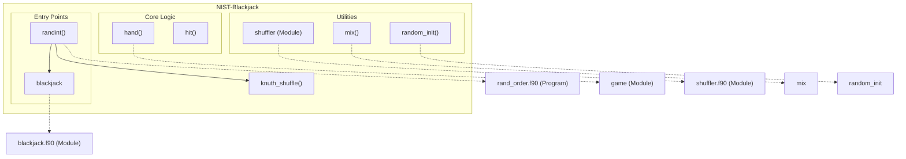

# NIST-Blackjack

## Overview

The **NIST-Blackjack** repository provides an implementation of a basic Blackjack game and related utilities written in Fortran. The core functionality includes simulating Blackjack gameplay where a player competes against a dealer, managing a standard 52-card deck, and shuffling via the Knuth (Fisher-Yates) shuffle algorithm. The repository supports both interactive game simulations and utility programs for generating and shuffling integer lists. It adheres to clean and modular design principles, making it an excellent example of modern Fortran programming.

## Key Features

- **Blackjack Simulation**: Implements the core gameplay mechanics of Blackjack, including player and dealer actions, and determining game outcomes (win, lose, push).
- **Card Shuffling**: Utilizes the Knuth shuffle algorithm to mimic realistic card shuffling for the 52-card deck.
- **Random Integer Shuffling**: A utility program to generate and shuffle integer lists, showcasing the flexibility of the Knuth shuffle implementation.
- **Debugging Mode**: Custom debug mode to provide additional insight and manual control during game testing.
- **Modular Structure**: Organized modules for gameplay (`game`), shuffling (`shuffler`), and utilities (`randint`) to ensure reusability and maintainability.
- **Integration with CI Tools**: Includes CI workflows for testing and validating the repository's codebase during development.

# Layout and Architecture
```
└── 5ce22566-6bc4-4c3e-bf9a-c464afe02f1a
    └── NIST-Blackjack
        ├── .github
        │   └── workflows
        │       └── ci.yml                # CI pipeline configuration.
        ├── CMakeLists.txt                # Build system configuration (CMake).
        ├── CMakePresets.json             # CMake presets for build automation.
        ├── LICENSE                       # Licensing information.
        ├── README.md                     # Project overview and instructions.
        ├── app
        │   ├── main.f90                  # Main blackjack game program.
        │   └── rand_order.f90            # Program to shuffle integers (e.g., teams).
        ├── fpm.toml                      # Fortran package manager configuration.
        ├── meson.build                   # Build system configuration (Meson).
        ├── src
        │   ├── blackjack.c               # C code for blackjack logic (if applicable).
        │   ├── blackjack.f90             # Core blackjack game logic module.
        │   └── shuffler.f90              # Utility module for array shuffling.
        └── tests
            ├── test_hit.cmake            # CMake test definition for hit().
            ├── test_hit.py               # Python test script for hit().
            └── y.asc                     # Encrypted or auxiliary test data.
```




## Usage Examples

### Build

#### Build the game (`Fortran` and `C`)

To compile the Fortran and C variants of the Blackjack game:
```sh
cmake -B build
cmake --build build
```

### Test

#### Run tests for both implementations

To run the default tests on both C and Fortran implementations:
```sh
ctest
```

### Run

#### Run the Fortran version of the game

To run the Fortran Blackjack game:
```sh
build/f_blackjack
```

To enable debug mode (manually input the next card):
```sh
build/f_blackjack -d
```

#### Run the C version of the game

To run the C-based Blackjack game:
```sh
build/c_blackjack
```

### Shuffle integers

The `rand_order.f90` program allows generating and shuffling integers using the Knuth shuffle algorithm. To run it:
```sh
build/rand_order
```


# Key Feature Implementation Deep Dive

## 1. Knuth Shuffle Algorithm
This algorithm, implemented in `shuffler.f90`, provides the randomness needed for various functionalities of the project, including shuffling the deck of cards in blackjack, and generating shuffled integers in `rand_order.f90`. Its implementation uses Fortran intrinsic random functions to perform the shuffle in-place by iterating through an array and swapping elements at random indices. 

### How It Works
1. Iterates backwards through the array using a loop.
2. Selects a random index less than or equal to the current position.
3. Swaps the item at the current position with the item at the randomly selected index, ensuring randomness in permutation.

Dependencies:
- Used extensively by the `mix` subroutine for deck shuffling in blackjack and the `randint` program for integer list shuffling.

## 2. Blackjack Gameplay (`hand` Function and `hit` Subroutine)
The `hand` function in `blackjack.f90` is central to simulating the blackjack game. It orchestrates player and dealer actions, manages the deck of cards, and calculates the game outcome. The `hit` subroutine assists in drawing a card and updating gameplay totals, including handling the nuances of Ace cards.

### How It Works:
1. Deck `cards` is shuffled via `mix`.
2. Player and dealer receive initial cards, and totals are calculated using the `hit` subroutine.
3. Player makes decisions (hit or stand), while the dealer plays according to blackjack rules.
4. Handles special cases like Blackjack, bust, or score comparison to determine winner.

Key Feature:
- Handles complex rules, such as adjusting for Ace cards and dealer thresholds.

Dependencies:
- Relies on the `knuth_shuffle` algorithm for randomizing cards.
- Operates as part of the `main.f90` program.

## 3. Deck Shuffling (`mix` Subroutine)
The `mix` subroutine in `blackjack.f90` initializes a deck of 52 cards with blackjack-specific values and shuffles it using `knuth_shuffle`. This ensures randomness before gameplay begins.

### How It Works:
1. Populates an array `cards` with values representing the deck:
   - Cards 2-10: Four copies each (one per suit).
   - Face cards (King, Queen, Jack): Represented by `10`.
   - Aces: Represented by `11`.
2. Passes the deck array to `knuth_shuffle` for random reordering.

Key Feature:
- Seamlessly integrates blackjack-specific rules in deck creation before shuffling.
- Used as a preprocessing step in gameplay.

Dependencies:
- Calls the `knuth_shuffle` subroutine in `shuffler.f90`.

## 4. Integer List Shuffling (`randint` Program)
The `randint` program in `rand_order.f90` demonstrates the Knuth shuffle algorithm for general integer lists. It's designed for applications like randomizing team numbers or generic integer ranges.

### How It Works:
1. Accepts maximum integer value `N` as user input.
2. Creates an integer array from 1 to N.
3. Utilizes `knuth_shuffle` to randomize order.

Key Feature:
- Adopts the same shuffling logic for generic use cases beyond blackjack.

Dependencies:
- Imports `knuth_shuffle` from the `shuffler` module.

## Integration and Collaborative Impact
The repo is a small but tightly integrated system:
- The Knuth shuffle algorithm serves as a core primitive reused across modules.
- The blackjack gameplay relies heavily on functionality created in the shuffler module, integrating seamlessly with the `mix` subroutine for deck preparation.
- The system’s modular design ensures reusability and ease of extension.

This structure would allow developers to:
1. Enhance shuffle randomness for better card game simulations.
2. Extend `randint` for broader applications in team or resource allocation.
3. Refactor high-level `main` program logic for additional command-line features or input validations.

These features form the backbone of the repo, interlinking logic and modularity to deliver core functionalities comprehensively.


# Implemented User Stories

## Deck Initialization and Manipulation
- [ ] As a game developer, I want to initialize a standard deck of 52 cards to simulate gameplay based on official blackjack rules, which requires proper card representations and numerical values.
- [ ] As a player, I want to shuffle a deck of cards before playing to ensure fairness, which requires implementing a Knuth shuffle algorithm.

## Blackjack Gameplay
- [ ] As a player, I want to draw (hit) cards during my turn to improve my chances of winning, which requires the game to process card totals and ace counts.
- [ ] As a dealer, I want to draw cards until my score is at least 17, to follow official blackjack rules, which requires automated summation of card values and ace adjustments.
- [ ] As a player, I want to choose to stop drawing cards, so I can avoid busting, which requires controls for player decisions during the game.
- [ ] As a player, I want the game to notify me when I win, tie, or lose after gameplay, which requires clear outcomes based on scores and rules.

## Random Order Program
- [ ] As a team manager, I want to randomly shuffle integers within a given range (e.g., team numbers) to ensure unbiased team order, which requires a Knuth shuffle implementation and range input validation.

## Debug Mode
- [ ] As a developer, I want to enable a debug mode to manually input cards, so I can test specific cases during development, which requires command-line argument parsing and user input integration.

## Game Outcomes
- [ ] As a player, I want the game to identify blackjack automatically, so that gameplay is optimized with fewer stages, which requires rules for 21 scores during initial card dealing.
- [ ] As a player, I want the game to calculate card scores dynamically using aces as either 1 or 11, so that my chances of winning are maximized, which requires flexible value adjustments based on hand totals.

## Random Initialization
- [ ] As a developer, I want to initialize random number generation in the game environment, so that shuffle and hit functions work properly, which requires random initialization functions.

## Command-line Interaction
- [ ] As a user, I want to provide command-line arguments for the game (e.g., debug mode or team range) to control its behavior, which requires command parsing and validation mechanisms.

## Game Execution
- [ ] As a blackjack enthusiast, I want to simulate an entire blackjack game round programmatically, so I can observe outcomes for various strategies, which requires integration of all methods including shuffling, hitting, and scoring.
- [ ] As a user, I want the program to read deck status, player decisions, and dealer outcomes, so the rules of blackjack are followed dynamically, which requires input and output handling in game logic.

## Testing and CI
- [ ] As a tester, I want automated systems to verify blackjack functions via Python scripts, so reliability is ensured, which requires Python Fortran interfacing and CI debugging tools.

## Build Integration
- [ ] As a developer, I want to build the program using multiple systems such as CMake and Meson, to ensure portable and flexible integration, which requires descriptor files for compilation environments.


# Dependencies


## Intrinsic

Standard Fortran intrinsic modules and functions.
- **iso_c_binding**
  - `c_int`
- **iso_fortran_env**
  - `ALL`
## Internal

Modules and functions defined within this project that are accessed in a different module or program.
- **shuffler**
  - `knuth_shuffle`
- **game**
  - `debug`
  - `hand`
  - `mix`
## External Functions

External (non-Fortran, bound with the C ABI) functions called by this project.
- `hit`
- `knuth_shuffle`
- `mix`
